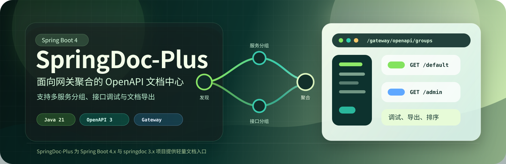
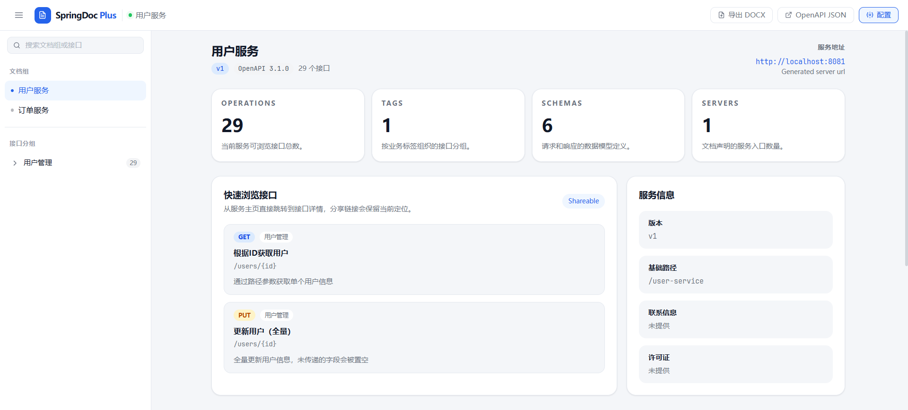
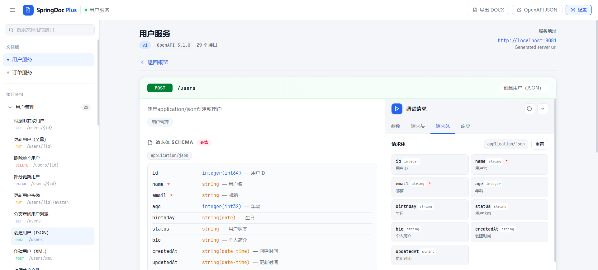
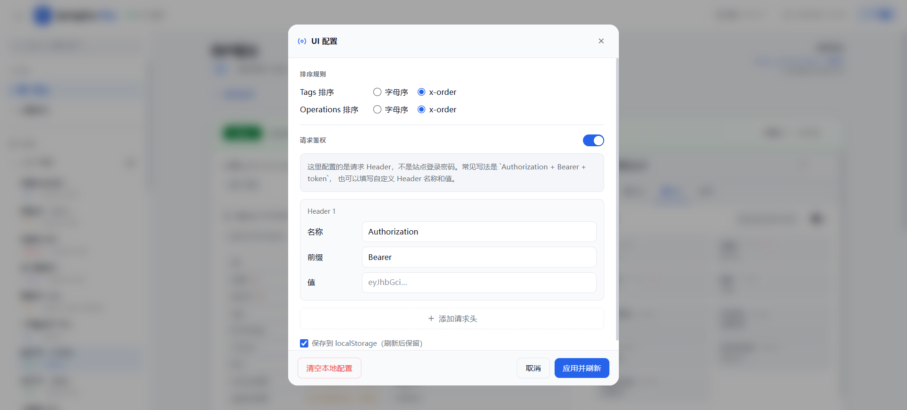
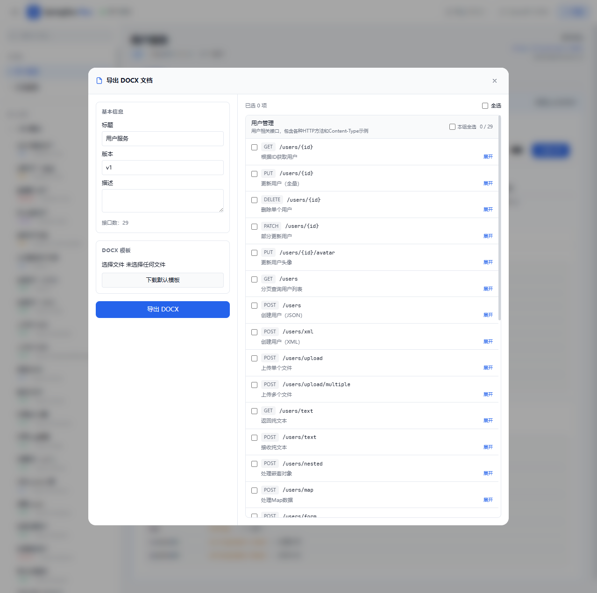

# SpringDoc-Plus

[English README](README.en.md)

<p align="center">
  
</p>

[](https://maven-badges.herokuapp.com/maven-central/io.github.weimin96/springdoc-plus)
[](https://github.com/weimin96/springdoc-plus/blob/main/LICENSE)
[](https://coveralls.io/github/weimin96/SpringDoc-Plus?branch=main)
[](https://www.oracle.com/java/technologies/downloads/)
[](https://spring.io/projects/spring-boot)

> 由于 Knife4j 长期未适配 Spring Boot 4.x + Jakarta EE，参考其设计思路重新实现，提供适配 **Spring Boot 4.0 + springdoc-openapi 3.x** 的 OpenAPI 文档聚合 UI，支持 Gateway 多服务聚合与单服务两种模式。

<table>
  <tr>
    <td align="center">
      <br/>
      <strong>概览</strong>
    </td>
    <td align="center">
      <br/>
      <strong>接口详情</strong>
    </td>
  </tr>
  <tr>
    <td align="center">
      <br/>
      <strong>设置</strong>
    </td>
    <td align="center">
      <br/>
      <strong>文档导出</strong>
    </td>
  </tr>
</table>

---

## 目录

- [特性](#特性)
- [技术栈](#技术栈)
- [模块说明](#模块说明)
- [快速开始](#快速开始)
    - [单服务模式](#单服务模式)
    - [网关聚合模式](#网关聚合模式)
- [运行 Demo 示例](#运行-demo-示例)
- [配置参数完整说明](#配置参数完整说明)
    - [单服务配置](#单服务配置-springdoc-plusopenapi3)
    - [网关聚合配置](#网关聚合配置-springdoc-plusgateway)
    - [GatewayRoute 字段](#gatewayroute-字段)
- [安全认证](#安全认证)
    - [Basic Auth 保护文档页面](#basic-auth-保护文档页面)
    - [UI 鉴权透传（Try it out）](#ui-鉴权透传try-it-out)
- [接口调试](#接口调试)
- [文档导出](#文档导出)
- [前端开发](#前端开发)
- [常见问题](#常见问题)
- [许可证](#许可证)

---

## 特性

| 功能 | 说明 |
|------|------|
| **网关聚合** | 支持 manual（手动配置路由）和 discover（基于服务发现自动聚合）两种模式 |
| **单服务模式** | 无需网关，单体应用直接使用，支持多分组配置 |
| **接口调试** | 内置调试面板，支持 path/query/header/cookie 参数，支持 JSON、form-data、multipart 请求体，支持文件上传 |
| **Basic Auth** | 可选为文档页面开启 HTTP Basic 保护，防止未授权访问，单服务和网关模式均支持 |
| **UI 鉴权透传** | 全局配置 Bearer Token 或自定义 Header，调试请求自动携带，可持久化到本地存储 |
| **DOCX 导出** | 一键导出当前服务接口文档为 Word 文档 |
| **x-order 排序** | 支持通过 `x-order` 扩展字段自定义 Tag / Operation 排序 |
| **YAML/JSON** | 自动识别 spec 格式，同时支持 JSON 和 YAML |
| **可分享链接** | 接口详情页 URL 包含定位信息，可直接分享给他人 |

---

## 技术栈

**后端**
- Java 21
- Spring Boot 4.0.5
- Spring Cloud 2025.1.0
- springdoc-openapi 3.0.3

**前端**（`springdoc-plus-web`）
- Vue 3.5 + TypeScript 5.9
- Tailwind CSS v4
- Vite 7

---

## 模块说明

```
springdoc-plus
├── springdoc-plus-core                          # 共享枚举、模型类（GatewayRoute、UiConfig 等）
├── springdoc-plus-ui                            # 前端构建产物打包模块（供两个 starter 依赖）
├── springdoc-plus-web                           # 前端源码（Vue 3 + Tailwind CSS v4）
├── springdoc-plus-openapi3-spring-boot-starter  # 单服务 starter
├── springdoc-plus-gateway-spring-boot-starter   # Spring Cloud Gateway 聚合 starter
└── springdoc-plus-samples                       # 示例工程
    ├── user-service-sample    (port 8081)
    ├── order-service-sample   (port 8082)
    └── gateway-sample         (port 8080)
```

---

## 快速开始

### 单服务模式

#### 1. 引入依赖

```xml
<dependency>
    <groupId>io.github.weimin96</groupId>
    <artifactId>springdoc-plus-openapi3-spring-boot-starter</artifactId>
    <version>0.1.6</version>
</dependency>
```

> 同时确保项目已引入 `springdoc-openapi-starter-webmvc-ui`，该 starter 会自动传递依赖。

#### 2. 启动类添加注解

```java
@OpenAPIDefinition(info = @Info(title = "用户服务", version = "v1"))
@SpringBootApplication
public class UserServiceApplication {
    public static void main(String[] args) {
        SpringApplication.run(UserServiceApplication.class, args);
    }
}
```

#### 3. 配置（可选）

默认无需任何配置即可使用，以下为完整可选配置项：

```yaml
springdoc-plus:
  openapi3:
    enabled: true           # 默认 true，设为 false 可整体关闭
    tags-sorter: order      # Tag 排序策略：alpha（字母序）| order（x-order 值）
    operations-sorter: order

    # 多分组配置（可选，不配置则使用默认的 /v3/api-docs 单分组）
    groups:
      - name: 用户接口
        url: /v3/api-docs
        context-path: /
        order: 1
      - name: 管理接口
        url: /v3/api-docs/admin
        context-path: /
        order: 2

    # UI 鉴权透传
    auth:
      enabled: true
      header-name: Authorization
      default-prefix: Bearer
      persist: true          # 是否保存 Token，UI 内可选择 sessionStorage 或 localStorage

    # HTTP Basic 保护（保护 /doc.html 页面本身）
    basic:
      enabled: false
      username: admin
      password: "{bcrypt}$2a$10$..."
```

#### 4. 访问

```
http://localhost:8080/doc.html
```

---

### 网关聚合模式

#### 1. 引入依赖（网关服务）

```xml
<dependency>
    <groupId>io.github.weimin96</groupId>
    <artifactId>springdoc-plus-gateway-spring-boot-starter</artifactId>
    <version>0.1.6</version>
</dependency>
```

各下游服务同样需要引入 `springdoc-plus-openapi3-spring-boot-starter` 以暴露 `/v3/api-docs` 接口。

#### 2. 网关配置 —— Manual 模式（推荐生产使用）

手动维护路由列表，配置清晰，不依赖服务注册中心：

```yaml
spring:
  cloud:
    gateway:
      server:
        webflux:
          routes:
            - id: user-service
              uri: http://localhost:8081
              predicates:
                - Path=/user-service/**
              filters:
                - StripPrefix=1
            - id: order-service
              uri: http://localhost:8082
              predicates:
                - Path=/order-service/**
              filters:
                - StripPrefix=1

springdoc-plus:
  gateway:
    enabled: true
    strategy: manual
    tags-sorter: order
    operations-sorter: order

    # Basic Auth 保护文档页面（可选）
    basic:
      enabled: false
      username: admin
      password: "{bcrypt}$2a$10$..."

    # UI 鉴权透传 - 调试接口时自动携带 Token
    auth:
      enabled: true
      header-name: Authorization
      default-prefix: Bearer
      persist: true

    routes:
      - name: 用户服务
        service-name: user-service
        url: /user-service/v3/api-docs
        context-path: /user-service
        order: 1
      - name: 订单服务
        service-name: order-service
        url: /order-service/v3/api-docs
        context-path: /order-service
        order: 2
```

#### 3. 网关配置 —— Discover 模式（自动聚合）

基于服务发现自动找到所有服务的 API 文档，适合服务数量多且频繁变动的场景：

```yaml
springdoc-plus:
  gateway:
    enabled: true
    strategy: discover
    discover:
      enabled: true
      version: openapi3                    # OpenAPI 版本
      excluded-services:
        - gateway-sample                   # 排除网关服务自身
        - config-server                    # 排除其他非业务服务
      openapi3-url: /v3/api-docs           # 各服务的文档路径（统一）
      resolve-context-path-from-gateway-routes: true  # 从 Gateway 路由推断 contextPath

      # 对特定服务做个性化配置（可选）
      service-config:
        user-service:
          order: 1
          group-name: 用户服务
          context-path: /user-service
        order-service:
          order: 2
          context-path: /order-service
          group-names:
            - default
            - admin     # 该服务有多个分组
```

> **Discover 模式前置条件：**
> 1. Gateway 已启用服务发现（`spring.cloud.gateway.discovery.locator.enabled=true`，或配置了 Simple Discovery）
> 2. 下游服务已注册到注册中心（Nacos、Consul、Eureka、Simple Discovery 等均可）

#### 4. 访问

```
http://localhost:8080/doc.html
```

---

## 运行 Demo 示例

### 1. 构建整个项目

```bash
mvn -q -DskipTests package
```

### 2. 分别启动三个服务

```bash
# 终端 1：用户服务（port 8081）
cd springdoc-plus-samples/user-service-sample
mvn -q spring-boot:run

# 终端 2：订单服务（port 8082）
cd springdoc-plus-samples/order-service-sample
mvn -q spring-boot:run

# 终端 3：网关（port 8080）
cd springdoc-plus-samples/gateway-sample
mvn -q spring-boot:run
```

### 3. 访问地址

| 地址 | 说明 |
|------|------|
| `http://localhost:8080/doc.html` | 网关聚合 UI（汇聚用户服务 + 订单服务） |
| `http://localhost:8081/doc.html` | 用户服务独立 UI |
| `http://localhost:8082/doc.html` | 订单服务独立 UI |

示例工程默认使用 **manual 模式**，如需切换为 discover 模式，将 `gateway-sample/src/main/resources/application.yml` 中的 `strategy: manual` 改为 `strategy: discover` 即可。

---

## 配置参数完整说明

### 单服务配置（`springdoc-plus.openapi3`）

| 参数 | 类型 | 默认值 | 说明 |
|------|------|--------|------|
| `enabled` | Boolean | `true` | 是否启用单服务文档功能 |
| `tags-sorter` | `alpha` \| `order` | `alpha` | Tag 排序策略。`order` 使用 `x-order` 扩展字段 |
| `operations-sorter` | `alpha` \| `order` | `alpha` | Operation 排序策略 |
| `groups[].name` | String | `default` | 分组名称，**不能为空** |
| `groups[].url` | String | `/v3/api-docs` | 分组对应的 OpenAPI 文档地址，**不能为空** |
| `groups[].context-path` | String | `/` | 该分组用于调试请求的 basePath |
| `groups[].order` | Integer | `0` | 分组排序权重，数值越小越靠前 |
| `auth.enabled` | Boolean | `true` | 是否在 UI 中展示鉴权配置入口 |
| `auth.header-name` | String | `Authorization` | 鉴权 Header 名称 |
| `auth.default-prefix` | String | `""` | 鉴权值前缀，如 `Bearer` |
| `auth.persist` | Boolean | `true` | 是否保存填写的 Token |
| `basic.enabled` | Boolean | `false` | 是否开启 HTTP Basic 保护文档页面 |
| `basic.username` | String | — | Basic Auth 用户名（`enabled=true` 时必填） |
| `basic.password` | String | — | Basic Auth 密码，生产环境建议使用 `{bcrypt}` 前缀哈希值 |

### 网关聚合配置（`springdoc-plus.gateway`）

| 参数 | 类型 | 默认值 | 说明 |
|------|------|--------|------|
| `enabled` | Boolean | `false` | 是否启用网关聚合 |
| `strategy` | `manual` \| `discover` | `MANUAL` | 聚合策略 |
| `tags-sorter` | `alpha` \| `order` | `alpha` | Tag 排序策略 |
| `operations-sorter` | `alpha` \| `order` | `alpha` | Operation 排序策略 |
| `routes` | List | `[]` | manual 模式的路由列表（见下表） |
| `discover.enabled` | Boolean | `false` | 是否启用服务发现 |
| `discover.version` | `openapi3` | `openapi3` | 下游服务的 API 规范版本 |
| `discover.excluded-services` | Set\<String\> | `[]` | 排除的服务名列表（支持精确匹配） |
| `discover.openapi3-url` | String | `/v3/api-docs` | 各服务统一的文档路径 |
| `discover.resolve-context-path-from-gateway-routes` | Boolean | `true` | 是否从 Gateway 路由 predicates 自动推断 contextPath |
| `discover.service-config` | Map | `{}` | 按 serviceId 对特定服务做个性化配置 |
| `auth.enabled` | Boolean | `true` | 是否启用 UI 鉴权透传 |
| `auth.header-name` | String | `Authorization` | 鉴权 Header 名称 |
| `auth.default-prefix` | String | `""` | 鉴权值前缀，如 `Bearer` |
| `auth.persist` | Boolean | `true` | 是否保存填写的 Token |
| `basic.enabled` | Boolean | `false` | 是否开启 HTTP Basic 保护文档页面 |
| `basic.username` | String | — | Basic Auth 用户名 |
| `basic.password` | String | — | Basic Auth 密码，生产环境建议使用 `{bcrypt}` 前缀哈希值 |

### GatewayRoute 字段

| 字段 | 类型 | 必填 | 说明 |
|------|------|------|------|
| `name` | String | 是 | 分组在 UI 中的显示名称 |
| `service-name` | String | 是 | 下游服务名（与 Gateway 路由 id 或服务注册名对应） |
| `url` | String | 是 | 通过网关访问下游 OpenAPI 文档的路径，如 `/user-service/v3/api-docs` |
| `context-path` | String | 否 | 调试请求时的 basePath 前缀，通常与 Gateway 路由的 `StripPrefix` 对应，如 `/user-service` |
| `order` | Integer | 否 | 排序权重，数值越小越靠前，默认 `0` |

---

## 安全认证

### Basic Auth 保护文档页面

两个 starter 均支持用 HTTP Basic 保护 `/doc.html`、`/springdoc-plus-ui/**` 及 `/springdoc-plus-gateway/**` 路径，防止未授权人员访问文档和前端依赖的配置接口。

```yaml
springdoc-plus:
  # 单服务用 openapi3，网关用 gateway
  openapi3:
    basic:
      enabled: true
      username: admin
      password: "{bcrypt}$2a$10$..."
```

启用后浏览器会弹出标准 Basic Auth 认证对话框。认证使用恒定时间比对，防止时序攻击。`password` 兼容明文配置，但生产环境应使用 `{bcrypt}` 前缀哈希值，避免将明文密码提交到 Git。

> Basic Auth 以 Base64 明文传输，生产环境请务必配合 HTTPS 使用。可以使用 Spring Security 的 BCrypt 工具生成密码哈希，配置时保留 `{bcrypt}` 前缀。

### UI 鉴权透传（Try it out）

在 UI 右上角"设置"中填写 Token，调试接口时会自动将其添加到请求头中，无需每次手动设置。

```yaml
springdoc-plus:
  gateway:
    auth:
      enabled: true
      header-name: Authorization   # 请求头名称
      default-prefix: Bearer       # 自动拼接前缀，填写 Token 时不需要手动加 "Bearer "
      persist: true                # 是否保存 Token，UI 内可选择 sessionStorage 或 localStorage
```

Token 保存到 `localStorage` 后会长期保留，若页面存在 XSS 漏洞，Token 可能被窃取。生产环境建议优先选择 `sessionStorage`，只在当前浏览器会话内保留 Token；如必须使用 `localStorage`，应配合严格的内容安全策略、短有效期 Token 与 HTTPS。

### 静态资源路径安全

网关 starter 对 `/springdoc-plus-ui/assets/{filename}`、`/springdoc-plus-ui/docs/{filename}` 与 `/springdoc-plus-ui/{filename}` 只接受单文件名，不允许 `..`、路径分隔符和常见 URL 编码路径片段。对应回归测试覆盖普通路径遍历、反斜杠路径遍历和编码路径遍历，防止通过文档静态资源端点读取受控目录外的 classpath 资源。

---

## 接口调试

接口详情页采用**左右分栏布局**：左侧展示接口文档（参数说明、请求体 Schema、响应文档），右侧固定显示调试面板。

调试面板支持：

| 类型 | 说明 |
|------|------|
| **路径参数**（path） | 自动识别 `{id}` 占位符并替换 |
| **查询参数**（query） | 自动拼接到 URL |
| **请求头**（header） | 可在调试面板"请求头"标签页手动添加 |
| **JSON 请求体** | 根据 Schema 自动生成示例，支持手动编辑 |
| **Form 表单**（`application/x-www-form-urlencoded`） | 逐字段填写 |
| **文件上传**（`multipart/form-data`） | 支持单文件和多文件 |
| **响应查看** | 展示状态码、响应头、响应体，JSON 自动格式化 |

调试参数和请求体会**自动保存**到本地存储

---

## 文档导出

在 UI 顶部工具栏点击「导出」，可将当前服务的接口文档导出为 **Word（.docx）** 文件，内容包含：

- 服务基本信息（版本、服务地址、联系方式）
- 按 Tag 分组的接口列表
- 每个接口的请求参数、请求体 Schema、响应定义

---

## 前端开发

前端源码位于 `springdoc-plus-web/`，基于 Vue 3 + TypeScript + Tailwind CSS v4。

```bash
cd springdoc-plus-web
pnpm install

# 开发模式（需要后端服务已启动在 8080）
pnpm dev

# 构建前端产物
pnpm run build

# Maven 构建时显式重建前端
cd ..
mvn -q -Pfrontend -pl springdoc-plus-ui package

# 构建示例工程
mvn -q -Psamples package

# 构建并复制产物到 springdoc-plus-ui
pnpm run deploy
```

---

## 常见问题

**Q: 为什么访问 `/doc.html` 提示 404？**

单服务模式请检查：
1. `springdoc-plus.openapi3.enabled` 是否为 `true`（默认值即为 true）
2. classpath 中是否存在 `springdoc-openapi-starter-webmvc-ui`

**Q: 为什么访问 `/doc.html` 时页面空白，浏览器控制台提示 CSS/JS 403 或 MIME type 错误？**

这通常不是前端构建产物损坏，而是业务项目自己的权限配置只放行了 `/doc.html`，没有放行文档页面继续依赖的静态资源和配置接口。  

SpringDoc-Plus 页面加载时还会继续请求：
- `/springdoc-plus-ui/**`
- `/springdoc-plus-gateway/**`
- `/v3/api-docs/**`

如果这些路径被 Spring Security 或其他鉴权拦截器拒绝，浏览器就会出现：
- `GET /springdoc-plus-ui/assets/*.css 403`
- `GET /springdoc-plus-ui/assets/*.js 403`
- `Refused to apply style ... MIME type ('') is not a supported stylesheet MIME type`

建议在业务项目的安全配置中显式放行这些文档相关路径，例如：

```java
@Bean
public SecurityFilterChain securityFilterChain(HttpSecurity http) throws Exception {
    http
            .authorizeHttpRequests(auth -> auth
                    .requestMatchers(
                            "/doc.html",
                            "/springdoc-plus-ui/**",
                            "/springdoc-plus-gateway/**",
                            "/v3/api-docs/**"
                    ).permitAll()
                    .anyRequest().authenticated()
            );
    return http.build();
}
```

**Q: 网关聚合后某个服务的接口"Try it out"请求失败，提示 CORS 或路径错误？**

检查 `context-path` 配置是否与网关路由的 `StripPrefix` 对应。例如：
```yaml
# Gateway 路由
- Path=/user-service/**
- StripPrefix=1
# 则 context-path 应配置为 /user-service
routes:
  - context-path: /user-service
```

**Q: Discover 模式下某些服务没有出现在文档列表中？**

1. 确认服务已成功注册到注册中心，可通过 `/actuator/gateway/routes` 验证
2. 检查 `excluded-services` 是否误将该服务排除
3. 确认该服务暴露了 `springdoc.api-docs.enabled=true` 且路径与 `openapi3-url` 一致

**Q: 如何使用 `x-order` 控制接口排序？**

在 `tags-sorter` / `operations-sorter` 设置为 `order` 后，可以优先使用 `@DocOrder` 简化接口排序：

```java
@DocOrder(1)
@GetMapping("/users")
public List<User> users() {
    return List.of();
}
```

也可以继续通过 springdoc 的扩展注解设置排序值：

```java
@Tag(
  name = "用户管理",
  extensions = @Extension(properties = @ExtensionProperty(name = "x-order", value = "1"))
)

@Operation(
  summary = "查询用户",
  extensions = @Extension(properties = @ExtensionProperty(name = "x-order", value = "1"))
)
```

**Q: Basic Auth 开启后 Spring Security 会冲突吗？**

不会。`BasicAuthFilter`（单服务）和 `BasicAuthWebFilter`（网关）只拦截文档相关路径（`/doc.html`、`/springdoc-plus-ui/**`、`/springdoc-plus-gateway/**`），不影响业务接口路由，也不依赖 Spring Security。

---

## 许可证

[MIT License](LICENSE)

## 贡献指南

欢迎提交 Issue 和 Pull Request。
